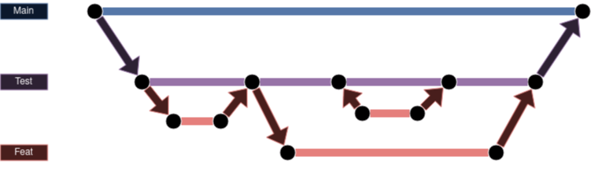

# Quiz app

## Description

ASP.NET based quiz app, which helps students and teachers to conduct quizes and make learning easier.

## Tech stack

## Table of contents

- [Quiz app](#quiz-app)
  - [Description](#description)
  - [Tech stack](#tech-stack)
  - [Table of contents](#table-of-contents)
  - [Branching strategy](#branching-strategy)
    - [Branches](#branches)
    - [Naming](#naming)
      - [Example](#example)
  - [Repository rules](#repository-rules)
  - [Tree](#tree)
    - [Notes](#notes)
  - [Authors](#authors)

## Branching strategy



### Branches

- **Main branch** - used as a production branch and is only updated when the app is ready for production.
- **Test branch** - used as a branch for all feature branches to merge and in this environment the app is tested.
- **Feat branch** - these branches are branched from *test branch* and are used for developing.
  - Each feature branch is used for a different task and each feature branch belongs to it's owner and should be worked on by the owner.

### Naming

- Branch names should begin with *feat*
- Feat branch name should give information about the task
- Words in branch name are seperated by dashes (-)
- If the feat branch is a branch of another feat branch, the name should have a number at the end

#### Example

- feat-pipeline
- feat-pipeline-2

## Repository rules

1. Approver count: 1
2. Feat branches merge to test

## Tree

``` bash
.
├── misc
│   └── branching_strat.png
└── README.md
```

### Notes

- Misc folder is used for storing images and miscellaneous items.

## Authors

- Aldas Vertelis
- Danielius Podbielski
- Kanstantinas Piatrashka
- Motiejus Šveikauskas
